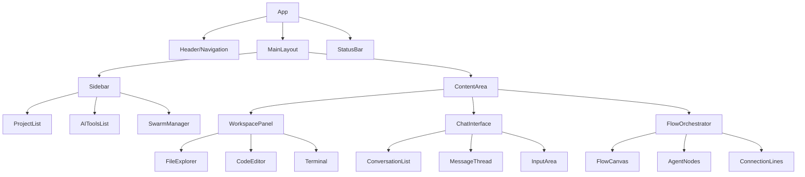
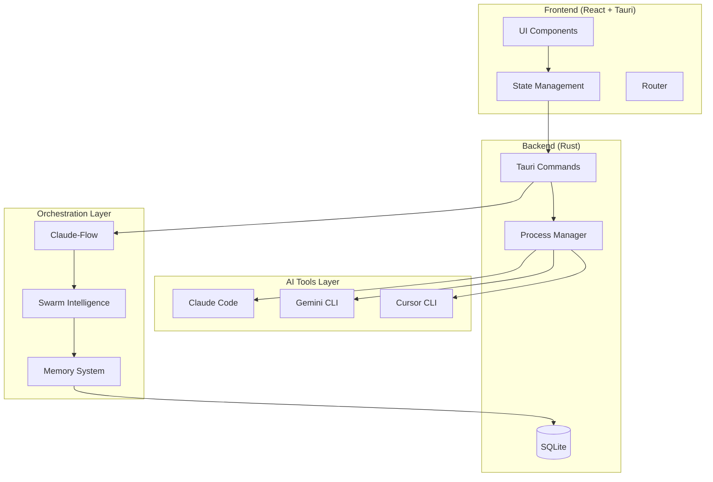
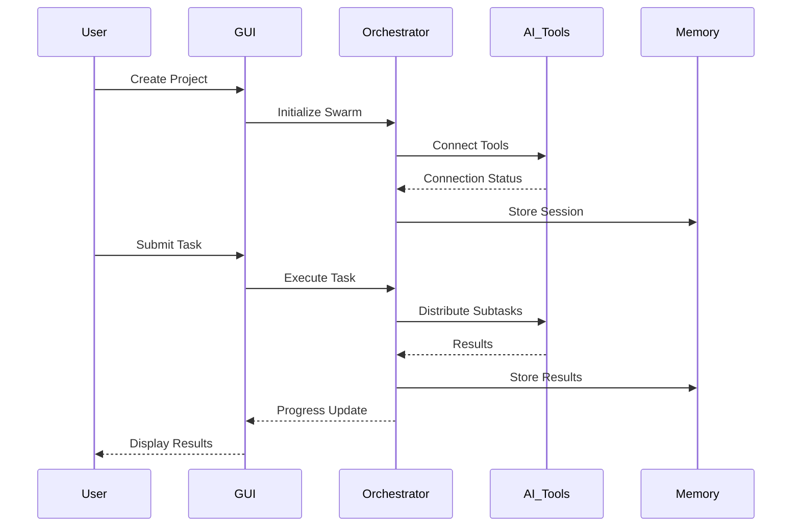

# AI Collaboration GUI - 설계 문서

## 개요

AI Collaboration GUI는 claude-code, gemini-cli, cursor-cli 등 다양한 AI CLI 도구들을 통합된 GUI 환경에서 사용하고, AI들 간의 협업을 통해 작업할 수 있도록 하는 데스크톱 애플리케이션입니다. Claudia의 GUI 기능과 Claude-Flow의 오케스트레이션 기능을 결합하여 직관적인 AI 협업 플랫폼을 제공합니다.

### 핵심 가치 제안
- **통합 AI 도구 관리**: 여러 AI CLI 도구를 하나의 GUI에서 관리
- **AI 협업 오케스트레이션**: 여러 AI가 협력하여 복잡한 작업 수행
- **시각적 워크플로우**: 직관적인 GUI를 통한 AI 작업 흐름 관리
- **프로젝트 중심 접근**: 프로젝트별 AI 세션 관리 및 히스토리 추적

## 기술 스택 및 의존성

### 프론트엔드
- **Framework**: React 18 + TypeScript
- **Build Tool**: Vite 6
- **UI Framework**: Tailwind CSS v4 + shadcn/ui
- **State Management**: Zustand
- **Desktop Framework**: Tauri 2

### 백엔드
- **Language**: Rust
- **Database**: SQLite (via rusqlite)
- **Process Management**: tokio
- **API**: Tauri Commands

### AI CLI 통합
- **Claude Code**: @anthropic-ai/claude-code
- **Gemini CLI**: Google AI CLI tools
- **Cursor CLI**: Cursor API integration
- **Claude-Flow**: AI 오케스트레이션 프레임워크

## 컴포넌트 아키텍처

### 컴포넌트 계층 구조



### 주요 컴포넌트 정의

#### 1. ProjectList 컴포넌트
```typescript
interface ProjectListProps {
  projects: Project[];
  selectedProject: string | null;
  onProjectSelect: (projectId: string) => void;
  onProjectCreate: () => void;
}

interface Project {
  id: string;
  name: string;
  path: string;
  lastModified: Date;
  aiTools: AITool[];
  sessions: Session[];
}
```

#### 2. AIToolsList 컴포넌트
```typescript
interface AIToolsListProps {
  tools: AITool[];
  activeTool: string | null;
  onToolSelect: (toolId: string) => void;
  onToolConfigure: (toolId: string) => void;
}

interface AITool {
  id: string;
  name: 'claude-code' | 'gemini-cli' | 'cursor-cli';
  status: 'connected' | 'disconnected' | 'error';
  config: ToolConfig;
}
```

#### 3. SwarmManager 컴포넌트
```typescript
interface SwarmManagerProps {
  swarms: Swarm[];
  activeSwarm: string | null;
  onSwarmCreate: (config: SwarmConfig) => void;
  onSwarmControl: (swarmId: string, action: SwarmAction) => void;
}

interface Swarm {
  id: string;
  name: string;
  agents: Agent[];
  status: 'idle' | 'running' | 'paused' | 'completed';
  workflow: WorkflowNode[];
}
```

#### 4. FlowOrchestrator 컴포넌트
```typescript
interface FlowOrchestratorProps {
  workflow: WorkflowNode[];
  onNodeAdd: (node: WorkflowNode) => void;
  onNodeConnect: (source: string, target: string) => void;
  onWorkflowExecute: () => void;
}

interface WorkflowNode {
  id: string;
  type: 'ai-task' | 'human-review' | 'condition' | 'merge';
  position: { x: number; y: number };
  data: NodeData;
  connections: Connection[];
}
```

## 라우팅 및 네비게이션

### 라우팅 구조
```typescript
const routes = [
  {
    path: '/',
    component: Dashboard,
    children: [
      { path: 'projects', component: ProjectManager },
      { path: 'projects/:id', component: ProjectWorkspace },
      { path: 'swarms', component: SwarmDashboard },
      { path: 'swarms/:id', component: SwarmWorkspace },
      { path: 'flows', component: FlowDesigner },
      { path: 'settings', component: Settings }
    ]
  }
];
```

### 네비게이션 패턴
- **Sidebar Navigation**: 주요 기능 영역 간 이동
- **Breadcrumb Navigation**: 현재 위치 표시 및 빠른 탐색
- **Tab Navigation**: 동일 영역 내 세부 기능 전환
- **Context Menu**: 우클릭을 통한 빠른 액션 실행

## 스타일링 전략

### 디자인 시스템

#### 색상 팔레트
```css
:root {
  /* Primary Colors */
  --primary-50: #f0f9ff;
  --primary-500: #3b82f6;
  --primary-900: #1e3a8a;
  
  /* Secondary Colors */
  --secondary-50: #f8fafc;
  --secondary-500: #64748b;
  --secondary-900: #0f172a;
  
  /* AI Status Colors */
  --ai-claude: #ff6b35;
  --ai-gemini: #4285f4;
  --ai-cursor: #000000;
  
  /* Status Colors */
  --success: #10b981;
  --warning: #f59e0b;
  --error: #ef4444;
}
```

#### 타이포그래피 스케일
```css
.text-display-large { font-size: 2.5rem; font-weight: 700; }
.text-headline-large { font-size: 2rem; font-weight: 600; }
.text-title-large { font-size: 1.5rem; font-weight: 500; }
.text-body-large { font-size: 1rem; font-weight: 400; }
.text-label-large { font-size: 0.875rem; font-weight: 500; }
```

#### 간격 시스템
```css
.space-unit-1 { margin: 0.25rem; }  /* 4px */
.space-unit-2 { margin: 0.5rem; }   /* 8px */
.space-unit-4 { margin: 1rem; }     /* 16px */
.space-unit-6 { margin: 1.5rem; }   /* 24px */
.space-unit-8 { margin: 2rem; }     /* 32px */
```

### 테마 지원
- **Light Theme**: 기본 밝은 테마
- **Dark Theme**: 어두운 테마 (개발자 친화적)
- **AI-Focused Theme**: AI 작업에 최적화된 고대비 테마

## 상태 관리

### Zustand 스토어 구조

#### 1. 프로젝트 스토어
```typescript
interface ProjectStore {
  // State
  projects: Project[];
  currentProject: Project | null;
  isLoading: boolean;
  
  // Actions
  loadProjects: () => Promise<void>;
  selectProject: (projectId: string) => void;
  createProject: (config: ProjectConfig) => Promise<Project>;
  updateProject: (projectId: string, updates: Partial<Project>) => void;
  deleteProject: (projectId: string) => Promise<void>;
}
```

#### 2. AI 도구 스토어
```typescript
interface AIToolsStore {
  // State
  tools: Map<string, AITool>;
  activeConnections: Map<string, Connection>;
  
  // Actions
  initializeTool: (tool: AITool) => Promise<void>;
  connectTool: (toolId: string, config: ConnectionConfig) => Promise<void>;
  disconnectTool: (toolId: string) => void;
  sendCommand: (toolId: string, command: Command) => Promise<Response>;
}
```

#### 3. 스웜 오케스트레이션 스토어
```typescript
interface SwarmStore {
  // State
  swarms: Map<string, Swarm>;
  activeSwarm: string | null;
  agents: Map<string, Agent>;
  
  // Actions
  createSwarm: (config: SwarmConfig) => Promise<Swarm>;
  addAgent: (swarmId: string, agent: Agent) => void;
  executeTask: (swarmId: string, task: Task) => Promise<TaskResult>;
  pauseSwarm: (swarmId: string) => void;
  resumeSwarm: (swarmId: string) => void;
}
```

## API 통합 레이어

### AI CLI 도구 통합

#### 1. Claude Code 통합
```typescript
class ClaudeCodeAdapter implements AIToolAdapter {
  private connection: ChildProcess | null = null;
  
  async connect(config: ClaudeConfig): Promise<void> {
    this.connection = spawn('claude', ['--api-mode'], {
      stdio: ['pipe', 'pipe', 'pipe']
    });
  }
  
  async sendMessage(message: string, context?: ProjectContext): Promise<AIResponse> {
    const command = {
      type: 'chat',
      message,
      project_path: context?.projectPath,
      files: context?.files
    };
    
    return this.executeCommand(command);
  }
  
  async codeEdit(filePath: string, instructions: string): Promise<EditResult> {
    const command = {
      type: 'edit',
      file: filePath,
      instructions
    };
    
    return this.executeCommand(command);
  }
}
```

#### 2. Gemini CLI 통합
```typescript
class GeminiCliAdapter implements AIToolAdapter {
  async connect(config: GeminiConfig): Promise<void> {
    // Gemini CLI 연결 로직
  }
  
  async generateCode(prompt: string, language: string): Promise<CodeGenerationResult> {
    const command = ['gemini', 'generate', '--language', language, '--prompt', prompt];
    return this.executeCommand(command);
  }
  
  async analyzeCode(filePath: string): Promise<AnalysisResult> {
    const command = ['gemini', 'analyze', '--file', filePath];
    return this.executeCommand(command);
  }
}
```

#### 3. Cursor CLI 통합
```typescript
class CursorCliAdapter implements AIToolAdapter {
  async connect(config: CursorConfig): Promise<void> {
    // Cursor CLI 연결 로직
  }
  
  async autoComplete(context: CodeContext): Promise<CompletionResult> {
    const command = {
      type: 'complete',
      context: context.text,
      position: context.position,
      language: context.language
    };
    
    return this.executeCommand(command);
  }
}
```

### Claude-Flow 오케스트레이션 통합

#### 1. 스웜 관리
```typescript
class SwarmOrchestrator {
  private claudeFlow: ClaudeFlowAPI;
  
  async createHiveMind(config: HiveMindConfig): Promise<SwarmSession> {
    const session = await this.claudeFlow.hiveMind.spawn(config.objective, {
      agents: config.agentCount,
      namespace: config.namespace,
      claude: true
    });
    
    return session;
  }
  
  async assignTask(swarmId: string, task: Task): Promise<TaskExecution> {
    return this.claudeFlow.swarm.execute(task.description, {
      swarmId,
      continueSession: true,
      strategy: task.strategy
    });
  }
  
  async queryMemory(namespace: string, query: string): Promise<MemoryResult> {
    return this.claudeFlow.memory.query(query, {
      namespace,
      recent: true,
      limit: 10
    });
  }
}
```

#### 2. 워크플로우 실행
```typescript
class WorkflowExecutor {
  async executeFlow(workflow: WorkflowDefinition): Promise<ExecutionResult> {
    const execution = new FlowExecution(workflow);
    
    for (const node of workflow.nodes) {
      const result = await this.executeNode(node);
      execution.recordResult(node.id, result);
      
      if (result.status === 'error') {
        return execution.fail(result.error);
      }
    }
    
    return execution.complete();
  }
  
  private async executeNode(node: WorkflowNode): Promise<NodeResult> {
    switch (node.type) {
      case 'ai-task':
        return this.executeAITask(node.data as AITaskData);
      case 'human-review':
        return this.requestHumanReview(node.data as ReviewData);
      case 'condition':
        return this.evaluateCondition(node.data as ConditionData);
      case 'merge':
        return this.mergeResults(node.data as MergeData);
    }
  }
}
```

## 테스팅 전략

### 단위 테스트 (Jest + React Testing Library)

#### 1. 컴포넌트 테스트
```typescript
describe('ProjectList Component', () => {
  test('renders project list correctly', () => {
    const mockProjects = [
      { id: '1', name: 'Test Project', path: '/test', lastModified: new Date() }
    ];
    
    render(<ProjectList projects={mockProjects} onProjectSelect={jest.fn()} />);
    
    expect(screen.getByText('Test Project')).toBeInTheDocument();
  });
  
  test('handles project selection', () => {
    const onProjectSelect = jest.fn();
    const mockProjects = [
      { id: '1', name: 'Test Project', path: '/test', lastModified: new Date() }
    ];
    
    render(<ProjectList projects={mockProjects} onProjectSelect={onProjectSelect} />);
    
    fireEvent.click(screen.getByText('Test Project'));
    expect(onProjectSelect).toHaveBeenCalledWith('1');
  });
});
```

#### 2. 스토어 테스트
```typescript
describe('ProjectStore', () => {
  test('loads projects correctly', async () => {
    const store = useProjectStore.getState();
    
    await store.loadProjects();
    
    expect(store.projects.length).toBeGreaterThan(0);
    expect(store.isLoading).toBe(false);
  });
  
  test('creates new project', async () => {
    const store = useProjectStore.getState();
    const config = { name: 'New Project', path: '/new' };
    
    const project = await store.createProject(config);
    
    expect(project.name).toBe('New Project');
    expect(store.projects).toContain(project);
  });
});
```

### 통합 테스트 (Tauri Test Framework)

#### 1. AI 도구 통합 테스트
```rust
#[cfg(test)]
mod tests {
    use super::*;
    use tauri::test::mock_context;
    
    #[tokio::test]
    async fn test_claude_code_integration() {
        let app = mock_context();
        let result = connect_claude_code(app, ClaudeConfig::default()).await;
        
        assert!(result.is_ok());
    }
    
    #[tokio::test]
    async fn test_swarm_creation() {
        let app = mock_context();
        let config = SwarmConfig {
            name: "test-swarm".to_string(),
            agent_count: 3,
            objective: "Test objective".to_string(),
        };
        
        let swarm = create_swarm(app, config).await;
        assert!(swarm.is_ok());
    }
}
```

### E2E 테스트 (Playwright)

#### 사용자 워크플로우 테스트
```typescript
test('AI collaboration workflow', async ({ page }) => {
  await page.goto('/');
  await page.click('[data-testid="create-project"]');
  await page.fill('[data-testid="project-name"]', 'Test Project');
  await page.click('[data-testid="start-swarm"]');
  await page.waitForSelector('[data-testid="swarm-completed"]');
});
```

## 아키텍처

### 시스템 아키텍처 다이어그램



### 데이터 플로우



## 데이터 모델

### 핵심 엔티티

#### 프로젝트 모델
```typescript
interface Project {
  id: string;
  name: string;
  path: string;
  description?: string;
  createdAt: Date;
  updatedAt: Date;
  settings: ProjectSettings;
  aiTools: AIToolConfig[];
  sessions: SessionSummary[];
}

interface ProjectSettings {
  defaultAITool: string;
  autoSave: boolean;
  collaborationMode: 'single' | 'swarm' | 'sequential';
  memoryRetention: number; // days
}
```

#### AI 도구 모델
```typescript
interface AITool {
  id: string;
  type: 'claude-code' | 'gemini-cli' | 'cursor-cli';
  name: string;
  version: string;
  status: ConnectionStatus;
  capabilities: Capability[];
  config: ToolSpecificConfig;
}

type ConnectionStatus = 'connected' | 'disconnected' | 'error' | 'connecting';

interface Capability {
  name: string;
  description: string;
  parameters: Parameter[];
}
```

#### 스웜 모델
```typescript
interface Swarm {
  id: string;
  name: string;
  projectId: string;
  objective: string;
  status: SwarmStatus;
  agents: Agent[];
  workflow: WorkflowNode[];
  memory: SwarmMemory;
  metrics: SwarmMetrics;
}

type SwarmStatus = 'initializing' | 'running' | 'paused' | 'completed' | 'failed';

interface Agent {
  id: string;
  type: AgentType;
  aiTool: string;
  role: string;
  specialization: string[];
  currentTask?: Task;
  performance: AgentMetrics;
}

type AgentType = 'queen' | 'architect' | 'developer' | 'tester' | 'reviewer';
```

#### 태스크 모델
```typescript
interface Task {
  id: string;
  title: string;
  description: string;
  type: TaskType;
  priority: Priority;
  dependencies: string[];
  assignedAgents: string[];
  status: TaskStatus;
  result?: TaskResult;
  estimatedTime: number;
  actualTime?: number;
}

type TaskType = 'code-generation' | 'code-review' | 'testing' | 'documentation' | 'analysis';
type Priority = 'low' | 'medium' | 'high' | 'critical';
type TaskStatus = 'pending' | 'in-progress' | 'completed' | 'failed' | 'cancelled';
```

### 데이터베이스 스키마

#### SQLite 테이블 구조
```sql
-- 프로젝트 테이블
CREATE TABLE projects (
    id TEXT PRIMARY KEY,
    name TEXT NOT NULL,
    path TEXT NOT NULL,
    description TEXT,
    settings JSON,
    created_at DATETIME DEFAULT CURRENT_TIMESTAMP,
    updated_at DATETIME DEFAULT CURRENT_TIMESTAMP
);

-- AI 도구 설정 테이블
CREATE TABLE ai_tools (
    id TEXT PRIMARY KEY,
    project_id TEXT,
    type TEXT NOT NULL,
    config JSON,
    status TEXT DEFAULT 'disconnected',
    FOREIGN KEY (project_id) REFERENCES projects(id)
);

-- 스웜 세션 테이블
CREATE TABLE swarm_sessions (
    id TEXT PRIMARY KEY,
    project_id TEXT,
    name TEXT NOT NULL,
    objective TEXT,
    status TEXT DEFAULT 'initializing',
    workflow JSON,
    metrics JSON,
    created_at DATETIME DEFAULT CURRENT_TIMESTAMP,
    FOREIGN KEY (project_id) REFERENCES projects(id)
);

-- 에이전트 테이블
CREATE TABLE agents (
    id TEXT PRIMARY KEY,
    swarm_id TEXT,
    type TEXT NOT NULL,
    ai_tool TEXT,
    role TEXT,
    specialization JSON,
    performance JSON,
    FOREIGN KEY (swarm_id) REFERENCES swarm_sessions(id)
);

-- 태스크 테이블
CREATE TABLE tasks (
    id TEXT PRIMARY KEY,
    swarm_id TEXT,
    title TEXT NOT NULL,
    description TEXT,
    type TEXT,
    priority TEXT DEFAULT 'medium',
    status TEXT DEFAULT 'pending',
    dependencies JSON,
    assigned_agents JSON,
    result JSON,
    estimated_time INTEGER,
    actual_time INTEGER,
    created_at DATETIME DEFAULT CURRENT_TIMESTAMP,
    FOREIGN KEY (swarm_id) REFERENCES swarm_sessions(id)
);

-- 메모리 테이블
CREATE TABLE memory_entries (
    id TEXT PRIMARY KEY,
    namespace TEXT,
    content TEXT,
    metadata JSON,
    embedding BLOB,
    created_at DATETIME DEFAULT CURRENT_TIMESTAMP
);
```